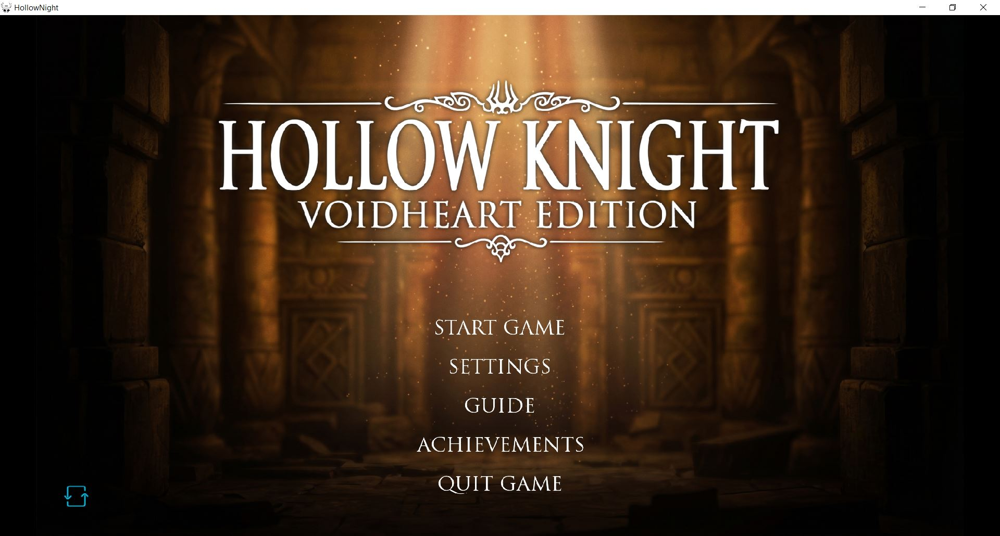
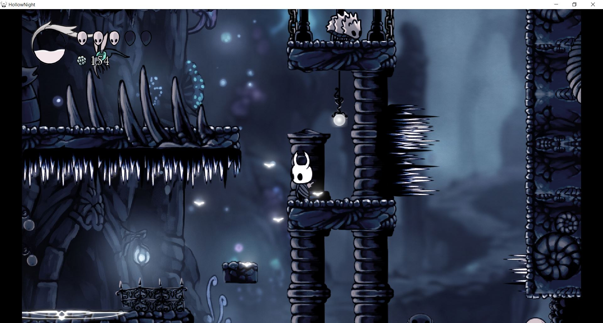
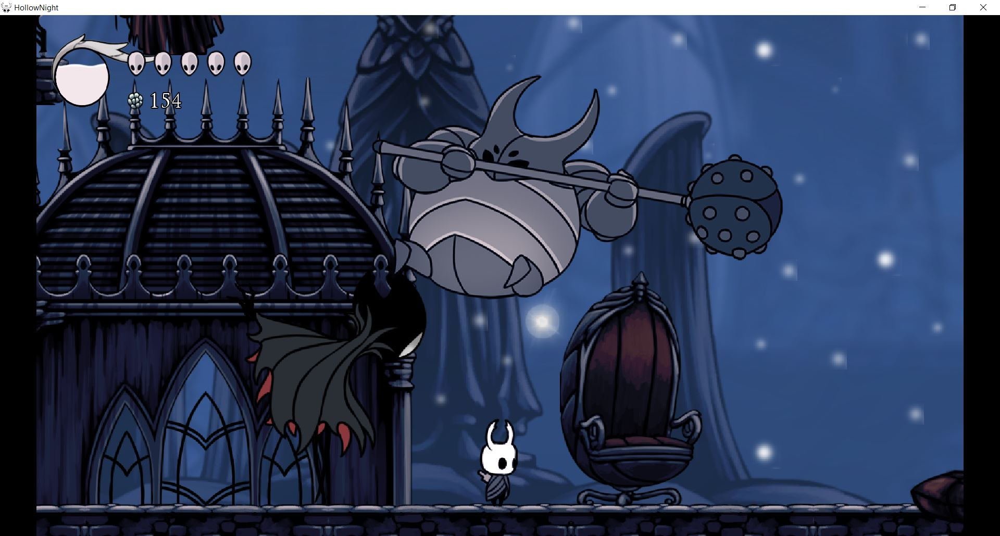
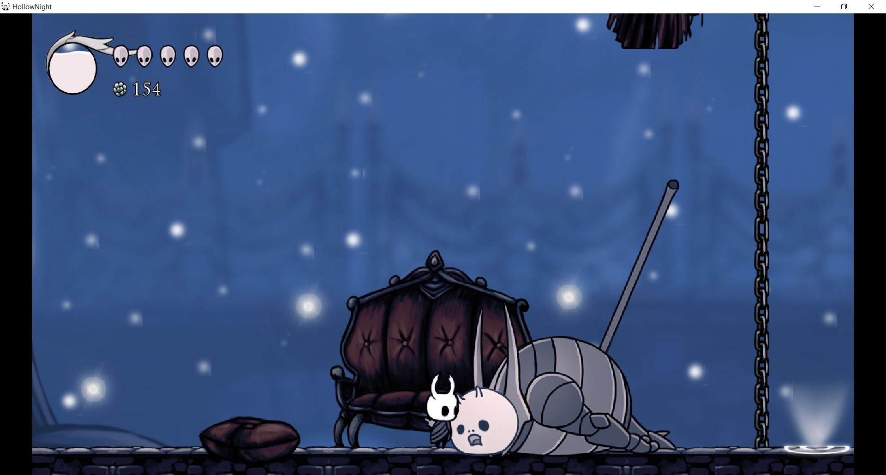
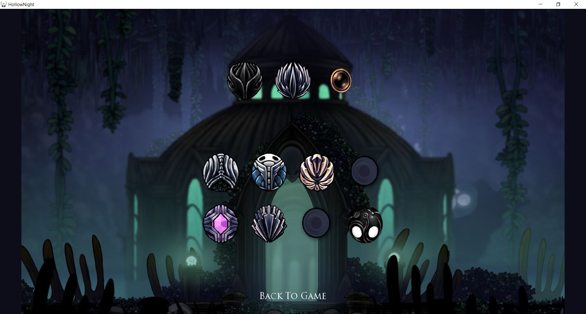
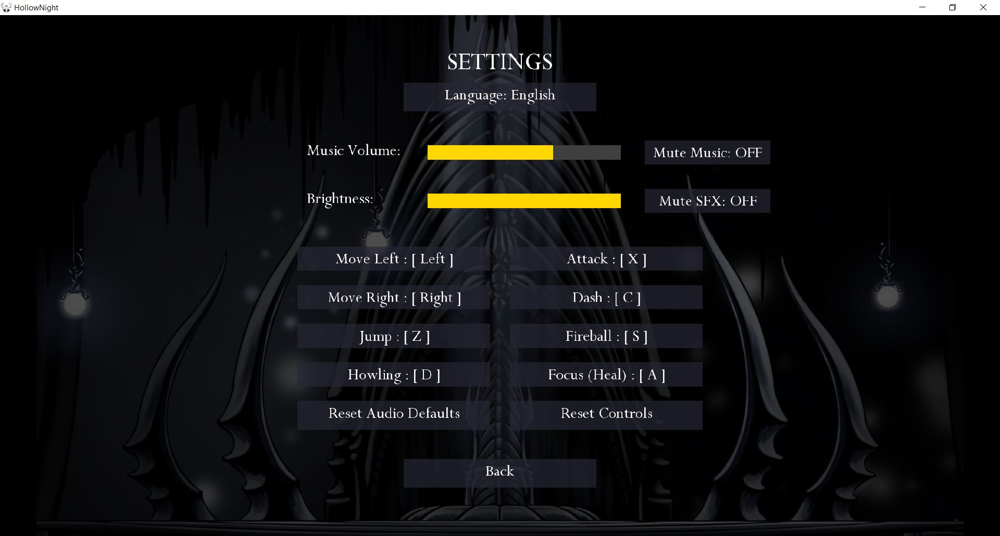
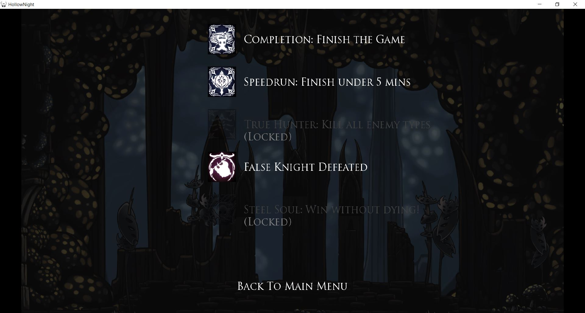
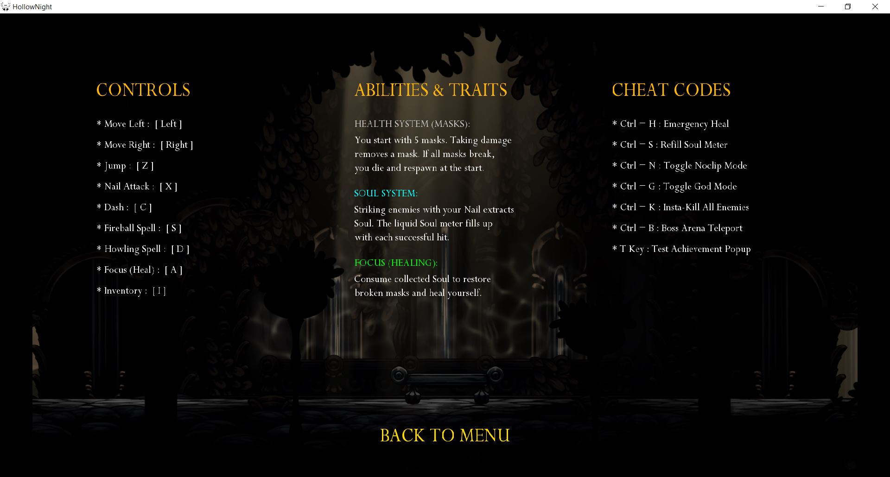
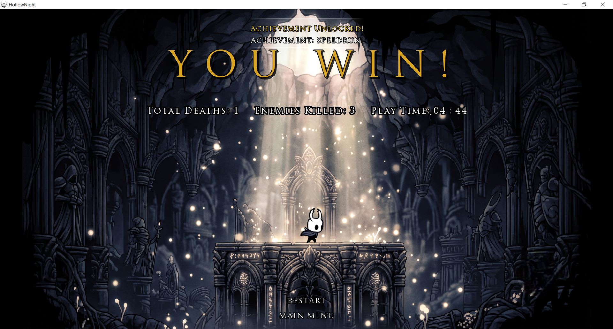

# ⚔️ Hollow Knight Clone - 2D Platformer

A 2D platformer game inspired by the popular game **Hollow Knight**, developed using **Java** and the **LibGDX** framework.

### 🎓 About the Project
This project was designed and implemented during my **second semester** as the **Advanced Programming graphical project** at **Sharif University of Technology**. The goal of this project was to implement Object-Oriented Programming (OOP) concepts, graphical resource management, basic physics, and software architecture within a complete game.

---

## 🌟 Key Features
* **Smooth Gameplay & Combat:** Implementation of the Knight's core movement mechanics including jumping, dashing, nail attacks (in multiple directions), and casting spells.
* **Charm System:** Features an Inventory system with the ability to equip various charms (e.g., Soul Catcher, Dashmaster) to enhance the player's abilities.
* **Enemies & Boss Fights:** AI for standard enemies (Tiktik, Mosquito, Husk) and challenging boss fights (False Knight and Crystal Guardian).
* **Soul Collection & Healing System:** Precise mechanics for gathering Soul by striking enemies and using it to Focus (heal masks).
* **Comprehensive UI Menus:** Includes a Main Menu, Settings (audio and keybinding customization), Game Guide, and an Achievements system.
* **Save/Load System:** Ability to save and load player progress using a database (includes location, Geo/coins, boss statuses, and achievements).
* **Cheat Codes:** Built-in cheat codes for easier game testing and debugging (e.g., God Mode, No-clip, and max Health/Soul).

---

## 🛠️ Technologies Used
* **Programming Language:** Java
* **Game Engine / Framework:** [LibGDX](https://libgdx.com/)
* **Level Design:** [Tiled Map Editor](https://www.mapeditor.org/) (`.tmx` maps)
* **Architecture:** Object-Oriented Design patterns (MVC-ish)

---

## 🎮 Game Controls (Default)
Game controls are fully customizable via the settings menu, but the default keys are as follows:

| Action | Key |
| :--- | :--- |
| Move Left / Right | `Arrow Keys` |
| Jump | `Z` |
| Nail Attack | `X` |
| Dash | `C` |
| Fireball Spell | `S` |
| Howling Spell | `D` |
| Focus / Heal | `A` |
| Open Inventory | `I` |
| Pause | `Esc` |

*(Note: While paused, pressing Esc gives you access to the cheat codes list and settings.)*

---

## 🚀 How to Run & Development Setup

Since this project is built using the **LibGDX** framework and utilizes **Tiled** for level design, you will need to set up your environment properly to run or modify the game.

### Prerequisites
1. **Java Development Kit (JDK):** Version 8, 11, or 17 is recommended.
2. **IDE:** **IntelliJ IDEA** (Recommended) or **Eclipse**.
3. **Tiled Map Editor:** (Optional) Download [Tiled](https://www.mapeditor.org/) if you wish to view or edit the game's `.tmx` map files.

### Installation & Execution Steps
1. **Clone the repository:**
   ```bash
   git clone https://github.com/s-a-jafari/Graphics-Project-of-AP.git
2. **Open the Project: Open your IDE and import the cloned folder as a Gradle project.**
3. **Sync Dependencies: Wait for Gradle to build the project and download all necessary LibGDX libraries.**
4. **Configure the Launcher... and Run...**


## 🖼️ Game Gallery


### 🎮 Gameplay & Combat
| Main Menu | Gameplay | Boss Fight |
| :--- | :--- | :--- |
|  |  |  |  |

### ⚙️ Systems & UI
| Inventory | Settings | Achievements | Guide |
| :--- | :--- | :--- | :--- |
|  |  |  |  |

### 🏆 Endings
| Boss Fight 2 | Win Menu |
| :--- | :--- |
|  |
